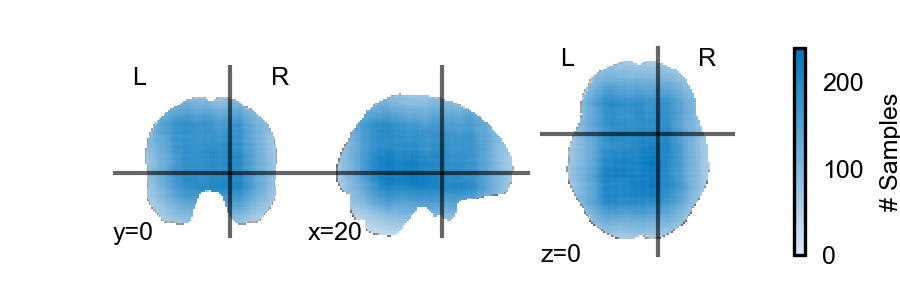
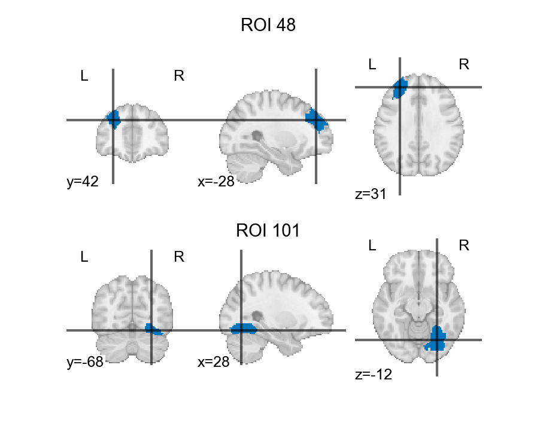
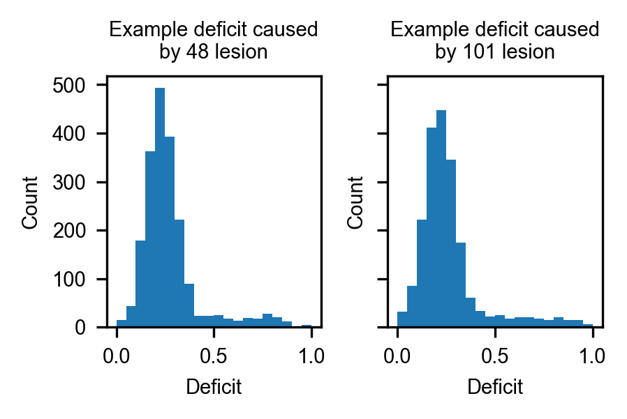
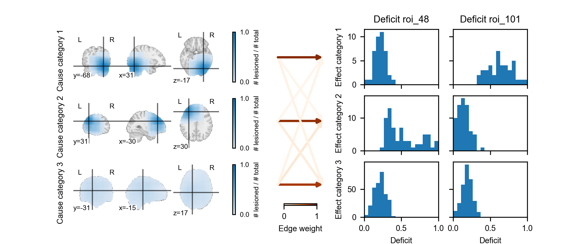

# Example CFL walkthrough

A minimal, fully-synthetic example of the code pipeline used for the real lesion cohorts.

## 1. Data generation

Data is generated by the scripts in [src/data_processing/example_data](../data_processing/example_data/) and saved to `data/example_data/` (and figures saved to `figures/example_data`):

- [format_lesions.py](../data_processing/example_data/format_lesions.py) simulates 2000 random cube-shaped lesions within the MNI brain mask and splits them into train/test (`X.npy`, `X_test.npy`).
- [format_deficits.py](../data_processing/example_data/format_deficits.py) generates two deficit scores (`Y.npy`, `Y_test.npy`, `deficit_names.npy`), each as a function of a simulated lesion's overlap with one of two Schaefer-200 ROIs (48 and 101).

```
python src/data_processing/example_data/format_lesions.py
python src/data_processing/example_data/format_deficits.py
```

<p align="center">
<br/>
<em>Heatmap of all 2000 simulated lesions.</em>
</p>

<p align="center">
<br/>
<em>The two Schaefer-200 ROIs (48 and 101) used to generate the deficit scores.</em>
</p>

<p align="center">
<br/>
<em>Distributions of the two simulated deficit scores across subjects.</em>
</p>

## 2. Set parameters

CFL block parameters (conditional density estimator, cause clusterer, effect clusterer) are set in [cfl_config.py](cfl_config.py). These are currently set to fixed values for simplicity, but please see other analyses for examples of how to specify parameter sweeps.

## 3. Run CFL

```bash
python src/example_cfl/run_cfl.py
```

By default (`--exp_id -1`) this trains a fresh CFL `Experiment` and saves results to `results/example_data/cfl_results/`. To just reproduce the figures below from the saved results instead of retraining, use the flags listed at the top of [run_cfl.py](run_cfl.py):

```bash
python src/example_cfl/run_cfl.py --exp_id 0 --plot_order_c 0 1 2 --plot_order_e 0 1 2
```

## 4. Results

<p align="center">
<br/>
<em>Lesion means by cause category (left), cause&ndash;effect category relations (middle), and deficit distributions by effect category (right).</em>
</p>

CFL recovers 3 cause (lesion) categories that recover the two deficit-generating regions and a catch-all category. On the effect side, CFL distinguishes deficits generated by ROI 48, ROI 101, and unaffected samples. Note that the two deficit-generating regions are far apart from one another, resulting in few/no samples where the lesion overlaps with both. However, if there were such samples we would expect to see interaction categories as well.
